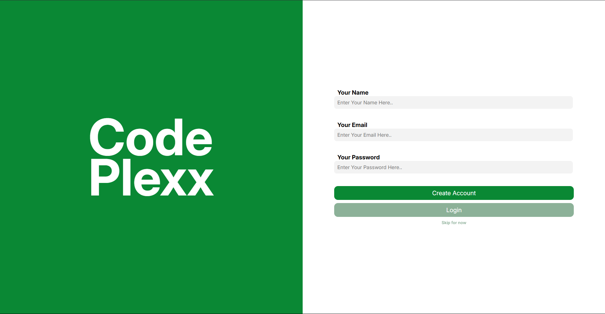

# Codeplexx

Codeplexx is a modern blog platform for developers to share and discover tech articles, tutorials, and news. Whether you're passionate about the latest frameworks, want to share your learning journey, or just love writing about technology, Codeplexx is your go-to place for insightful and beginner-friendly content. 

<p align="center">
  
</p>

---

## How It Started?

> "I love reading tech articles and tutorials, but most are either too complex or just copies of documentation, making them hard for beginners. As a developer, I wanted to create a platform that makes tech content accessible and engaging. Inspired by Bill Gates' CodePlex and the UI/UX of TechCrunch, I dedicated over two months to building Codeplexx from scratch—writing every line of code myself, with a little help from Copilot for error fixing and demo data."

---
<p align="center">
  <a href="https://codeplexx.vercel.app">🌐 Live Website</a> 
</p>

---

## 🛠️ Tech Stack

- **Website:** Next.js (Full Stack, Modular CSS)
- **Storage:** Supabase
- **Hosting:** Vercel
- **App:** React Native Expo (in progress)

---

## 🌐 Web Routes

| Route | Description |
|-------|-------------|
| `/` | Register & Login |
| `/user/home` | Home page to read blogs |
| `/user/blogs/:id` | Read individual blogs |
| `/user/blogs/:id/edit` | Edit your own blogs |
| `/user/profile` | View writer profiles |
| `/user/profile/:name/edit` | Edit your profile |
| `/user/search/:query` | Universal search for blogs |

---

## 📁 Folder Structure

```text
codeplexx/
│
├── assets/                # Project images and assets
│
├── expo-app/              # React Native Expo mobile app (WIP)
│
├── web-app/               # Next.js web application
|
├── package.json           # Project metadata and scripts
└── readme.md              # Project documentation
```

---

## 🤝 Contributing

Contributions are welcome! Please open issues or submit pull requests to help improve Codeplexx.

---

## 📬 Contact

- **Author:** [Saumya Kanti Sarma](https://github.com/Saumya-Kanti-Sarma)
- **Twitter:** [@devloper_saumya](https://x.com/devloper_saumya)
- **Email:** [dev.saumyasarma@gmail.com](mailto:dev.saumyasarma@gmail.com)